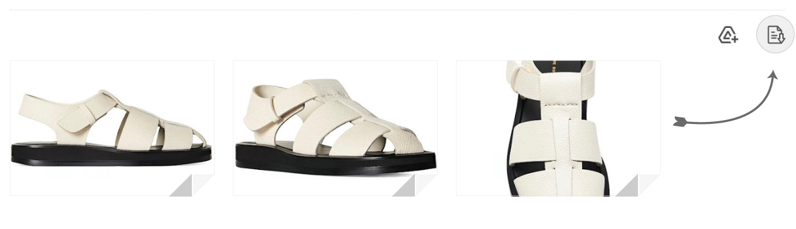

<!-- lorewound:standard:start -->
# Gmail Bulker

<div align="center">
  
  <p><strong>Bulk Gmail workflow extension</strong></p>
  <p>Created by Gazi Enes Sedef · Published by Lorewound</p>

  
  
</div>

## ◈ Overview

Gmail Bulker is a Chrome extension for organizing repetitive Gmail actions into a more efficient browser workflow. It provides focused controls while relying on explicitly restricted Google API access.

## ✦ Highlights

- Bulk Gmail operations
- Chrome extension interface
- Restricted Google API integration

## ⬡ Technology

- See the detailed project guide and source tree for implementation details.

## ▣ Platforms

- Chrome desktop

## ▶ Getting Started

```text
Review the project-specific detailed documentation below
```

Use the versions recorded in the repository lockfiles and manifests. Secrets belong in ignored local environment files or the deployment platform's secret store; never place credentials in client code or commits.

## ✓ Quality and Maintenance

- Maintenance policy: [MAINTENANCE.md](MAINTENANCE.md)
- Shared legal documentation: [Lorewound Legal Docs](https://github.com/katsopolis/Legal-Docs)
- Repository: [https://github.com/katsopolis/Gmail-Bulker](https://github.com/katsopolis/Gmail-Bulker)

## ◇ Ownership and Publishing

| Role | Details |
| --- | --- |
| Creator and producer | Gazi Enes Sedef |
| Publisher | Lorewound |
| Contact | [support@lorewound.com](mailto:support@lorewound.com) |
| Repository owner | [katsopolis](https://github.com/katsopolis) |

## ⚖ License

This project is proprietary and is not open source. No use, execution, copying, modification, distribution, hosting, or commercial exploitation is permitted without prior written permission. See [LICENSE](LICENSE). Third-party components and assets remain subject to their respective licenses.
<!-- lorewound:standard:end -->

---

## ◆ Detailed Project Guide

The maintained project summary above is canonical. The original detailed documentation is preserved below for implementation-specific guidance.


# Gmail Bulker

Gmail Bulker downloads every Gmail attachment and Google Drive file link from an open conversation as a single ZIP, preserving original filenames and formats.

## Key Features

- **ZIP Download** - Bundles all files into a single ZIP with one click
- **Drive Body Link Detection** - Scans the email body for `drive.google.com/file/d/...` links that Gmail does not expose as attachment cards
- **Clipped Message Support** - Automatically fetches the full message HTML when Gmail clips long emails, so no Drive links are missed
- **InboxSDK Integration** - Uses Gmail's native attachment download URLs when available
- **Background Service Worker** - Downloads Drive files through the extension's service worker to bypass CORS and CSP restrictions
- **Response Validation** - Detects HTML error/login/permission pages and does not silently save them as files
- **Filename Preservation** - Extracts real filenames from link text, DOM attributes, and Content-Disposition headers
- **Deduplication** - Same Drive file appearing multiple times in the email body or as both an attachment card and a body link results in only one ZIP entry

## Preview



## Installation

### Load as unpacked extension (recommended)

1. Download or clone this repository:
   ```bash
   git clone https://github.com/lorewound/Gmail-Bulker.git
   ```
2. Open `chrome://extensions` in Chrome (or any Chromium-based browser).
3. Enable **Developer mode** (toggle in the top-right corner).
4. Click **Load unpacked** and select the `Gmail-Bulker` folder.
5. Open Gmail. The extension activates automatically on `mail.google.com`.

### Terminal shortcut (macOS)

```bash
git clone https://github.com/lorewound/Gmail-Bulker.git ~/Gmail-Bulker
open "chrome://extensions"
```

Then enable Developer mode, click Load unpacked, and point to `~/Gmail-Bulker`.

## Usage

1. Open any Gmail conversation.
2. **If the email has attachment cards**: a ZIP download button appears in the attachments toolbar.
3. **If the email only has Drive file links in the body** (no attachment cards): a "Download X Drive file(s) as ZIP" button appears above the message body.
4. Click the button. If the message is clipped, the extension automatically fetches the full message to find all links.
5. A single ZIP file downloads containing all files.

## Changelog

### Version 1.1.0 - Drive Body Link Support (Latest)

- **Drive Link Scanning**: Detects `drive.google.com/file/d/`, `/open?id=`, and `/uc?id=` links embedded in the email body
- **Clipped Message Auto-Fetch**: When Gmail shows "Message clipped / View entire message", the extension fetches the full HTML through the background worker and extracts all Drive links
- **DOM-Injected Download Button**: When no Gmail attachment cards exist, a styled button is injected above the message body
- **Drive Download Validation**: Background worker validates responses - detects HTML error pages, login redirects, virus scan confirmations, and retries with `confirm=t` parameter
- **Content-Disposition Filename**: Extracts the real filename from the Drive download response headers when available
- **Deduplication**: Same file ID appearing multiple times (icon link + filename link) produces only one ZIP entry
- **Turkish Gmail Support**: Clipped message detection works with Turkish locale ("Ileti kisaltildi / Tum iletiyi goruntule")
- **InboxSDK Error Silencing**: Suppresses `waitFor timeout`, `WaitForError`, and injected script errors from cluttering the console
- **Uncaught Exception Handler**: Catches InboxSDK's unhandled promise rejections and global errors silently
- **New module: driveLinks.js**: Small, testable helper functions for Drive URL parsing, filename extraction, deduplication, and clipped message detection

### Version 1.0.5 - Stability & Console Cleanup

- InboxSDK error suppression improvements
- Message handler hardening in background.js
- Removed aggressive URL cleaning that could corrupt download URLs
- Dead code removal

### Version 1.0.3 - ZIP Download & Drive Support

- ZIP archive download for all attachments
- Google Drive CORS bypass via background service worker
- JSZip integration for client-side ZIP creation
- Timestamp-based ZIP naming

### Version 1.0.2 - Performance & Analysis

- Metadata extraction and logging
- URL validation and quality detection
- Enhanced DOM fallback URL extraction
- Download progress tracking

## Architecture

```
Gmail Page (mail.google.com)
    |
    |-- content scripts (isolated world)
    |       |-- inboxsdk.js      (Gmail SDK)
    |       |-- jszip.min.js     (ZIP library)
    |       |-- util.js          (sanitize, ZIP helper)
    |       |-- driveLinks.js    (Drive URL parsing, dedup, clipped detection)
    |       |-- app.js           (main logic, button injection, download orchestration)
    |
    |-- pageWorld.js (main world, injected by InboxSDK)
    |
    |-- background.js (service worker)
            |-- fetchAttachmentBlob   (Gmail attachment fetch)
            |-- fetchDriveFile        (Drive file fetch with validation)
            |-- fetchFullMessageHTML   (clipped message full HTML fetch)
```

### Download Flow

1. **Button appears** when InboxSDK detects a message with attachments, or when `driveLinks.js` finds Drive links in the body.
2. **On click**: extracts Gmail attachments (existing InboxSDK flow) + scans body for Drive links.
3. **If clipped**: fetches full message HTML via background worker, extracts additional links.
4. **Merges and deduplicates** all sources by Drive file ID.
5. **Downloads each file** through the background service worker (bypasses CORS/CSP).
6. **Validates responses**: rejects HTML error pages, retries virus scan confirmations.
7. **Creates ZIP** with JSZip and triggers browser download.

## Permissions

| Permission | Reason |
|---|---|
| `storage` | InboxSDK requirement |
| `downloads` | Triggering ZIP file download |
| `scripting` | Injecting pageWorld.js into Gmail |
| `https://mail.google.com/` | Content script injection |
| `https://drive.google.com/*` | Fetching Drive files |
| `https://drive.usercontent.google.com/*` | Drive download redirects |
| `https://mail-attachment.googleusercontent.com/*` | Gmail attachment downloads |

## License

This project is proprietary and is not open source. No use, execution, copying, modification, distribution, hosting, or commercial exploitation is permitted without prior written permission. See [LICENSE](LICENSE). Third-party components and assets remain subject to their respective licenses.

## Author

**Gazi Enes Sedef** - [Lorewound](https://github.com/lorewound)

## Operational documentation

[Security policy](SECURITY.md) · [Service configuration and operations](SERVICES.md)
